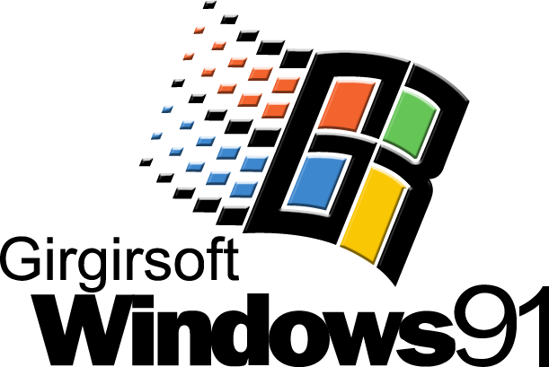

# Girgir OS

- 작업 기간 : 2024년 7월 ~ 2024년 8월
- 사용기술 : Vite, React, Typescript

이 포트폴리오 사이트는 90년대 Windows를 컨셉으로 작업 했습니다.

제가 레트로한 감성을 좋아하기도 하고, 호불호가 갈릴 수도 있지만 조금 더 기억에 남을 수 있게 재미있는 포트폴리오 사이트를 만들고 싶었습니다. 

그동안 재직 중 제 관심 분야였던 스크롤 인터렉션을 만드는 작업과 퍼포먼스를 최적화 하는 경험은 많이 있었지만, 
아쉽게도 프론트 엔드 기술을 활용 할 수 있는 프로젝트를 접할 기회가 없었습니다. 
때문에 혼자서 `React`와 `Typescript`를 틈틈히 공부했고 이번 포트폴리오에서 `Vite, React, Typescript`를 사용하여 작업 할 수 있었습니다.

사이트 링크 : [@girgir.dev](http://girgir.synology.me/)